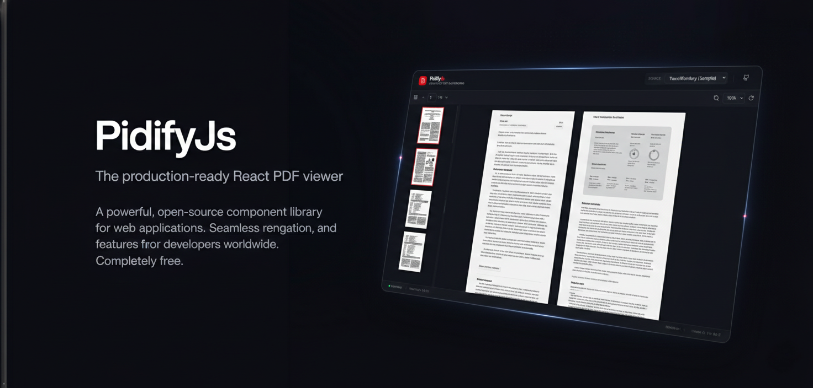

# PidifyJS

> A modern, feature-rich PDF viewer component library for React with a beautiful UI, built with TypeScript and TailwindCSS

[](LICENSE)
[](#-status)
[](https://nodejs.org/)
[](https://www.typescriptlang.org/)
[](https://react.dev/)



## Table of Contents

- [PidifyJS](#pidifyjs)
  - [Table of Contents](#table-of-contents)
  - [Overview](#overview)
  - [Features](#features)
  - [Quick Start](#quick-start)
    - [Prerequisites](#prerequisites)
    - [Installation](#installation)
    - [Basic Usage](#basic-usage)
  - [Examples](#examples)
  - [Project Structure](#project-structure)
  - [Development](#development)
    - [Setup Development Environment](#setup-development-environment)
  - [Contribution Guidelines](#contribution-guidelines)
  - [License](#license)
  - [Community](#community)
  - [Security](#security)

## Overview

**PidifyJS** is a powerful, production-ready PDF viewer component library for React applications. Built with modern web technologies, it provides a comprehensive set of features for rendering, navigating, and annotating PDF documents with an intuitive and responsive user interface.

Whether you're building a document management system, e-signature application, or any solution that requires PDF viewing capabilities, PidifyJS has you covered.

## Features

- **Modern UI** - Clean, intuitive interface built with TailwindCSS
- **Responsive Design** - Seamless experience across all device sizes
- **High Performance** - Optimized rendering with smooth animations
- **Navigation Tools** - Page navigation, zoom controls, and rotation
- **Annotations** - Highlights, notes, and drawing capabilities
- **Bookmarks** - Create and manage bookmarks for quick navigation
- **Document Outline** - Auto-generated table of contents from PDF structure
- **Text Layer Support** - Searchable and selectable text in PDFs
- **Accessibility** - Built with accessibility in mind
- **Dark Mode Ready** - Fully compatible with dark mode themes
- **Tree-shakeable** - Only import what you need
- **TypeScript First** - Fully typed for superior developer experience

## Quick Start

### Prerequisites

- Node.js >= 18.0.0
- pnpm >= 10.0.0 (or npm/yarn)
- React 18+ or React 19+
- React DOM 18+ or React DOM 19+

### Installation

```bash
# Coming soon to npm registry
# For now, install from source during development

# Clone the repository
git clone https://github.com/GitCoder052023/PidifyJs.git
cd PidifyJs

# Install dependencies
pnpm install

# Build the library
cd source/packages/core
pnpm build
```

> 📌 **Note:** PidifyJS is currently under active development and not yet published on npm. It's ready for early adoption and community contributions.

### Basic Usage

```tsx
import React from 'react'
import { PDFViewer } from '@pidifyjs/core'
import '@pidifyjs/core/styles.css'

export default function App() {
  return (
    <div className="w-full h-screen">
      <PDFViewer
        data={{
          url: 'https://example.com/document.pdf'
        }}
      />
    </div>
  )
}
```

## Examples

Check out the `source/Examples` directory for ready-to-use examples with both React and Next.js! These examples show you how to integrate PidifyJS into different types of projects and can be a great reference when building your own implementation.

```bash
cd source/Examples
# Browse the React and Next.js example applications
```

## Project Structure

```
PidifyJs/
├── source/
│   ├── packages/
│   │   └── core/              # Main PDF viewer library
│   │       ├── src/
│   │       │   ├── components/  # React components
│   │       │   ├── hooks/       # Custom React hooks
│   │       │   ├── types/       # TypeScript types
│   │       │   └── constants/   # Configuration constants
│   │       └── vite.config.ts
│   ├── app/                   # Demo Next.js application
│   └── Examples/              # React and Next.js examples
├── .github/                   # GitHub templates
├── .husky/                    # Git hooks
└── package.json
```

## Development

### Setup Development Environment

```bash
# Install dependencies
pnpm install

# Start development server
cd source/packages/core
pnpm dev

# Run linting
pnpm lint

# Build for production
pnpm build
```

## Contribution Guidelines

- Follow the [Contributor Covenant](CODE_OF_CONDUCT.md)
- Use [conventional commits](https://www.conventionalcommits.org/)
- Keep commits atomic and focused
- Write descriptive pull request titles and descriptions
- Link related issues in PR descriptions
- Update documentation accordingly

For more details, see [CONTRIBUTING.md](CONTRIBUTING.md).

## License

This project is licensed under the **MIT License** - see the [LICENSE](LICENSE) file for details.

## Community

- **Questions?** Open a [GitHub Discussion](https://github.com/GitCoder052023/PidifyJs/discussions)
- **Found a bug?** Open a [GitHub Issue](https://github.com/GitCoder052023/PidifyJs/issues)
- **Feature request?** Share your ideas in [GitHub Discussions](https://github.com/GitCoder052023/PidifyJs/discussions)

## Security

For security vulnerabilities, please see [SECURITY.md](SECURITY.md) for reporting guidelines.

---

<div align="center">

**[Report Bug](https://github.com/GitCoder052023/PidifyJs/issues) • [Request Feature](https://github.com/GitCoder052023/PidifyJs/discussions) • [View Changelog](https://github.com/GitCoder052023/PidifyJs/releases)**

Made with ❤️ by the PidifyJS Community

</div>